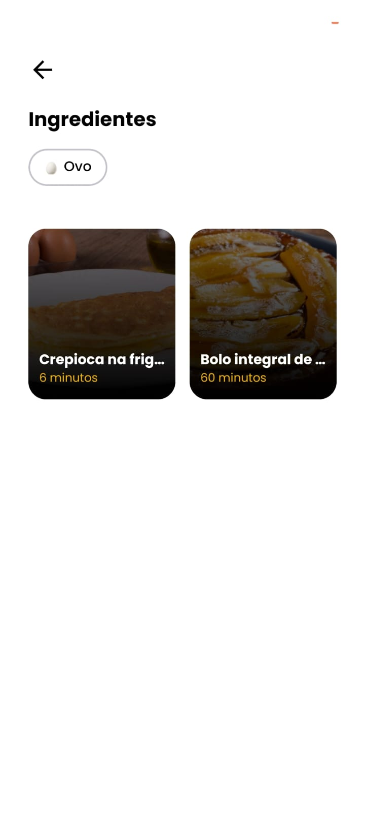
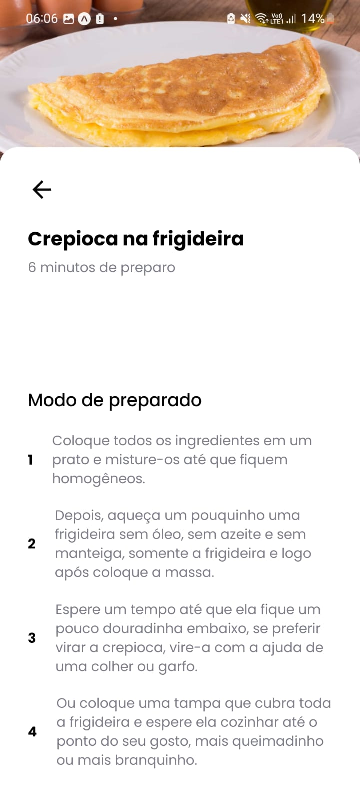

# Cook App

## Stacks utilizadas

- React Native
- Typescript
- Expo
- Expo Router
- Reanimated
- Supabase

## Prints do projeto

### Selecione os ingredientes

### Encontre as receitas

### Selecione a receita que deseja

### Prepare sua receita 😋

### Links

🔴 **Figma do projeto:** [Cook App](<https://www.figma.com/file/lwB5BA6VZX8yzqJLYo3nzf/Cook-App-(Copy)?type=design&node-id=0-1&mode=design&t=Nciktd1jqB2WkOHJ-0>)
